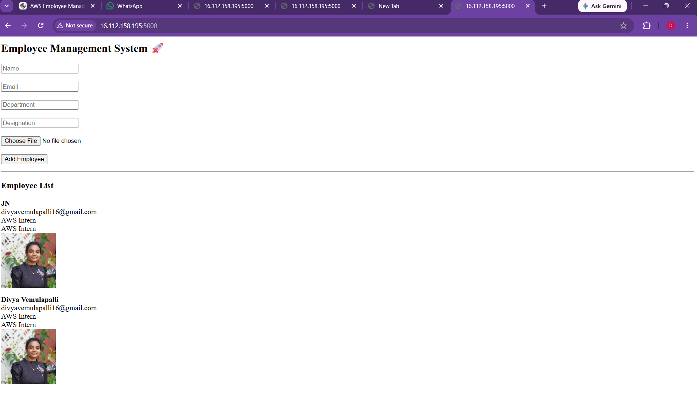
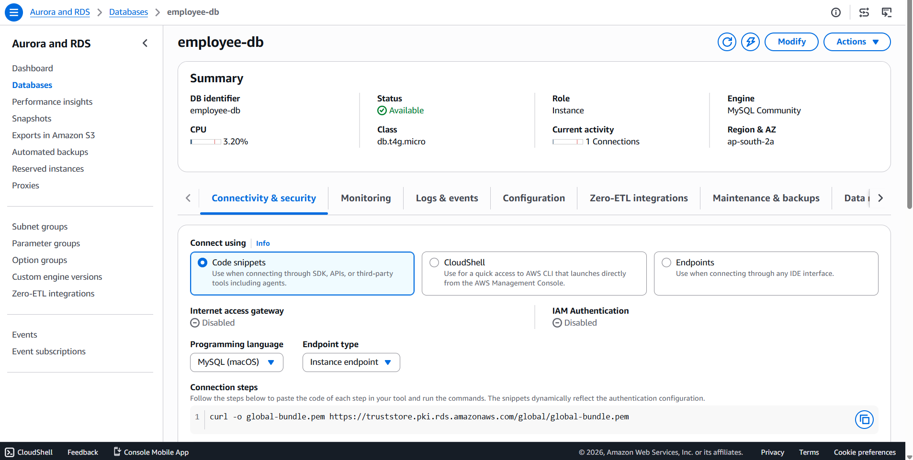
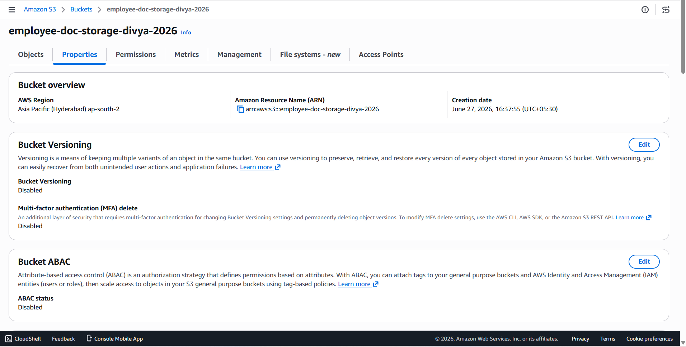
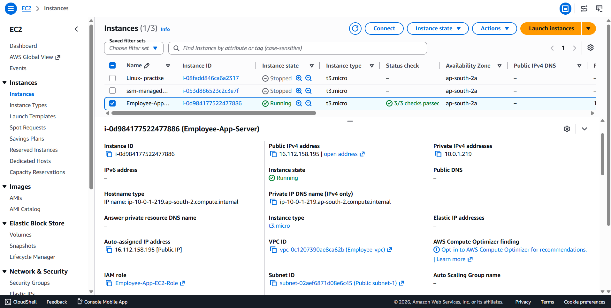
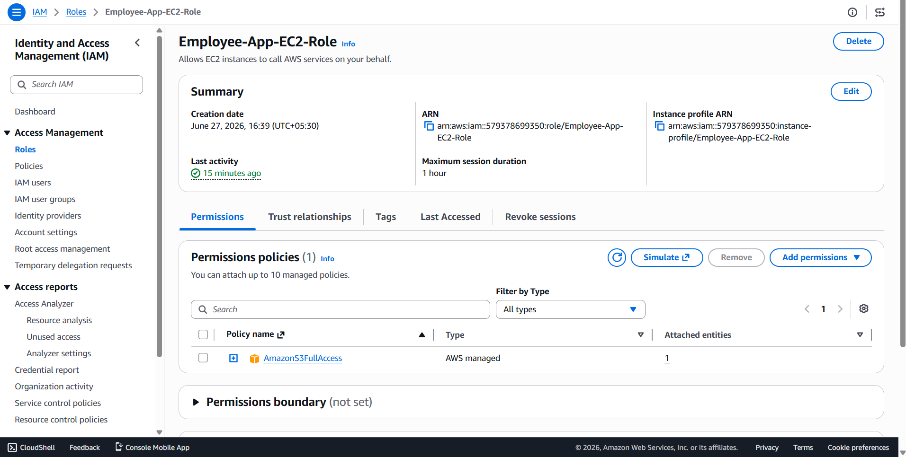
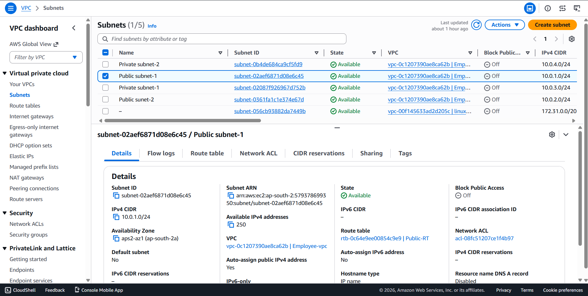

# Cloud-Based Employee Management System (AWS Project)

##  Overview
This is a full-stack cloud-based Employee Management System deployed on AWS.  
It demonstrates real-world cloud architecture using EC2, RDS, S3, IAM, and VPC.

Users can add employee details and upload profile images, which are stored securely in AWS S3, while structured data is stored in AWS RDS (MySQL). The application is hosted on an EC2 instance using Flask.

---

##  AWS Architecture

This project uses the following AWS services:

- 🌐 VPC (Networking Layer)
- 🖥️ EC2 (Application Hosting)
- 🗄️ RDS MySQL (Database)
- 📂 S3 (File Storage)
- 🔐 IAM (Access Control & Permissions)
- ⚖️ Security Groups (Traffic Control)

---

##  Features

- Add employee details (Name, Email, Department, Designation)
- Upload employee profile images
- Store structured data in AWS RDS (MySQL)
- Store images securely in AWS S3 bucket
- Display employee list with images
- Fully cloud-hosted and scalable application

---

##  Tech Stack

- Python (Flask)
- HTML (Jinja Templates)
- AWS EC2
- AWS RDS (MySQL)
- AWS S3
- AWS IAM
- AWS VPC

---

##  screenshots

###  Application Homepage


---

###  AWS RDS Database


---

###  S3 Bucket (Uploaded Images)


---

###  EC2 Instance Running Application


---

###  IAM Role Configuration


---

###  VPC Architecture Setup


---

##  How to Run Locally

```bash
git clone <your-repo-url>
cd employee-app
pip install -r requirements.txt
python app.py